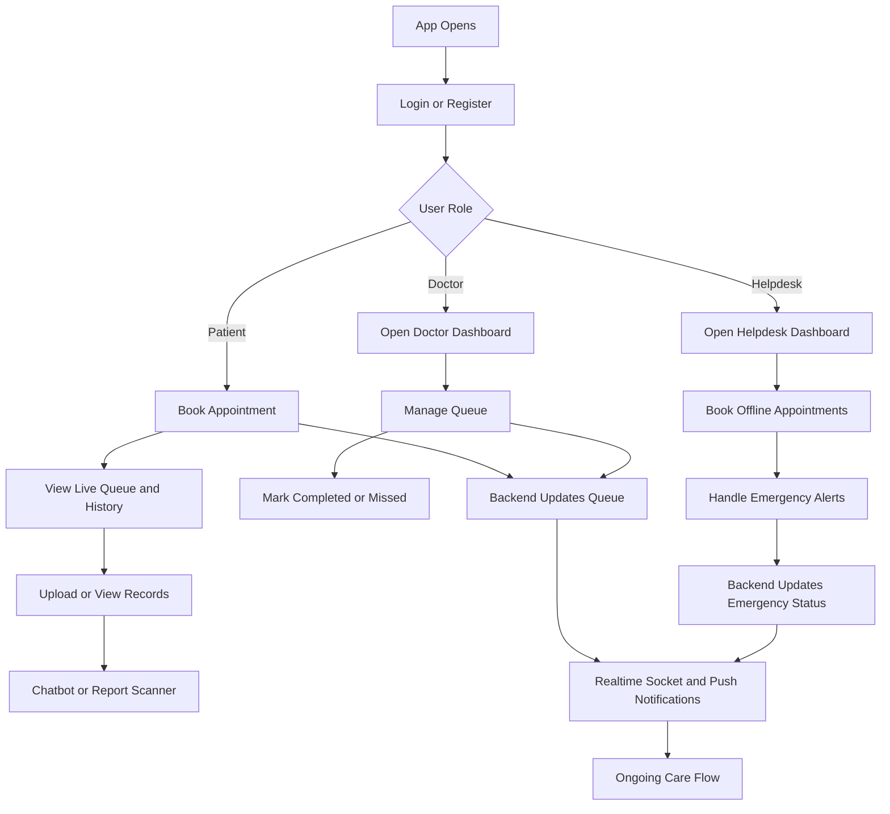

# 🏥 Smart Healthcare Website

A modern, AI-powered Smart Healthcare Web App designed to enhance hospital experiences, reduce wait times, and improve emergency response — all while ensuring secure access to medical information. 

---

## 🚀 Features

### 📍 Locate Nearby Hospitals
Easily find hospitals closest to your location using real-time geolocation data.

### 📅 Online Appointment Scheduling
Book medical consultations and specialist visits through an integrated appointment booking system.

### 🕒 Real-Time Queue & Crowd Management
View current queue status in real time to minimize overcrowding and waiting times.

### 📁 Digital Medical Report Storage
Upload, manage, and access your health records anytime with secure cloud storage integration.

### 🧠 AI-Powered Report Summarization
Automatically summarize complex medical reports into simplified versions using cutting-edge AI models.

### 💬 AI Chatbot for Health Queries
Get instant answers to general health-related questions through a smart AI-powered chatbot trained on medical knowledge.

### 🚨 Emergency Response System
A one-tap emergency alert button sends real-time SOS signals to the nearest hospital for immediate ambulance dispatch and response.

---

## 🛠️ Tech Stack

- **Frontend**: React.js, Tailwind CSS / Custom CSS
- **Backend**: Node.js, Express.js
# Smart-HealthCare

Smart-HealthCare is a full-stack healthcare platform with role-based workflows for patients, doctors, and helpdesk staff.

It includes online appointment booking, doctor queue management, emergency alert handling, patient medical records, PWA support, real-time updates (Socket.IO), and web push notifications.

## Core Features

- Patient, Doctor, Helpdesk authentication with JWT
- Nearby hospital discovery using geolocation + Google Maps
- Appointment booking (today and future dates)
- Doctor-side live queue dashboard (call next, mark completed/missed)
- Helpdesk dashboard for emergency notifications and offline walk-in bookings
- SOS emergency flow with nearest-hospital routing and action tracking
- Patient medical vault with cloud file uploads
- AI chatbot for basic health guidance
- AI report scanner (OCR + simplified explanation)
- PWA install support + service worker caching + push notifications

## Tech Stack

- Frontend: React, Vite, React Router, Socket.IO Client
- Backend: Node.js, Express, Socket.IO
- Database: MongoDB + Mongoose
- Auth: JWT
- File Upload: Multer + Cloudinary
- Maps/Location: Google Maps API
- AI: OpenRouter (chat), Google Vision + Gemini (report scanner)
- Notifications: Web Push (VAPID) + Service Worker

## Project Structure

```text
Smart-HealthCare/
  Backend/
    controllers/
    middleware/
    models/
    routes/
    services/
    server.js
  Frontend/
    public/
      manifest.json
      sw.js
    src/
      Components/
      context/
      services/
      App.jsx
      main.jsx
```

## Simple Workflow



## Local Setup

### 1) Install dependencies

Open two terminals from project root:

```bash
cd Backend
npm install
```

```bash
cd Frontend
npm install
```

### 2) Configure environment variables

Create `.env` files in both `Backend/` and `Frontend/`.

Backend `.env` (required):

```env
MONGO_URI=
JWT_SECRET=
JWT_EXPIRES_IN=7d
CLIENT_URL=http://localhost:5173
PORT=5000

VAPID_PUBLIC_KEY=
VAPID_PRIVATE_KEY=

OPENROUTER_API_KEY=

CLOUDINARY_CLOUD_NAME=
CLOUDINARY_API_KEY=
CLOUDINARY_API_SECRET=
CLOUDINARY_FOLDER=patient-vault
```

Frontend `.env` (required for full features):

```env
VITE_MAP_API=
VITE_GEMINI_API_KEY=
VITE_VISION_API_KEY=
```

### 3) Run the app

Backend:

```bash
cd Backend
npm run dev
```

Frontend:

```bash
cd Frontend
npm run dev
```

### 4) Open in browser

- Frontend: `http://localhost:5173`
- Backend health check: `http://localhost:5000/api/health`

## Main API Groups

- `/api/auth` - login/register
- `/api/hospitals` - nearby and hospital lookup
- `/api/doctors` - doctor listing/profile/availability
- `/api/appointments` - booking, history, status, feedback
- `/api/queues` - doctor queue operations
- `/api/emergency` - SOS alerts and management
- `/api/records` - patient record upload and retrieval
- `/api/notifications` - hospital emergency notifications
- `/api/chat` - health assistant responses
- `/api/push` - push subscription management

## Notes

- Service worker is registered in the frontend HTML and supports offline caching + push handling.
- Push notifications require valid VAPID keys and browser notification permission.
- Cloud uploads are handled via Cloudinary middleware in backend routes.

## License

MIT
